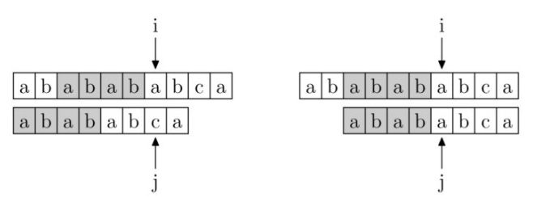

Knuth-Morris-Pratt 字符串查找算法（简称为 KMP 算法）可在一个主文本字符串 S 内查找一个词 W 的出现位置。此算法通过运用对这个词在不匹配时本身就包含足够的信息来确定下一个匹配将在哪里开始的发现，从而避免重新检查先前匹配的字符

主要参考的链接为[第一条回答](https://www.zhihu.com/question/21923021)

要理解 KMP 算法，首先要搞懂 PMT 表，也就是部分匹配表。 PMT 的值是字符串的前缀集合与后缀集合的交集中最长元素的长度，那么对于字符串"ababababca"而言，PMT 就如下所示：

| char:  | a   | b   | a   | b   | a   | b   | c   | a   |
| :----: | --- | --- | --- | --- | --- | --- | --- | --- |
| index: | 0   | 1   | 2   | 3   | 4   | 5   | 6   | 7   |
|  pmt:  | 0   | 0   | 1   | 2   | 3   | 4   | 0   | 1   |

假设要查找的字符串为 abababca ，如果在 j 处字符不匹配，那么主字符串中 i 指针之前的 PMT[j-1] 位就一定与模式字符串的前 PMT[j-1] 位是相同的，于是就保持主字符串的 i 指针不动，j 指针移到模式字符串的 PMT[j-1] 位即可

