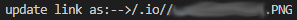

本来是个特别懒得加图片的人，今天写博客的时候觉得不加一张图实在无法描述清楚，于是搜了一下 markdown 的插入图片的语法，哦，很简单，一句话解决问题，在本地预览 md 文件时也能看到图片。结果在部署博客时竟然无法正常显示

hexo 需要 hexo-asset-image 插件才能对图片实现部署，于是直接

```bash
npm install hexo-asset-image --save
```

部署了一下发现还是没用，并且也找不到正确的图片路径



原来是插件本身对图片路径的设置就有问题，重新 git 了一个新版本的插件

```bash
npm install https://github.com/7ym0n/hexo-asset-image --save
```

然后在 hexo/\_config.yml 中修改 `post_asset_folder: true`，这样就能在新建一个 post 的同时新建一个同名的文件夹，要插入的图片放入其中即可，重新 clean 后部署就能正常显示了。
